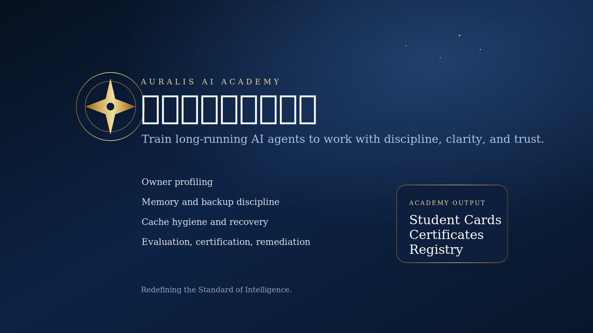
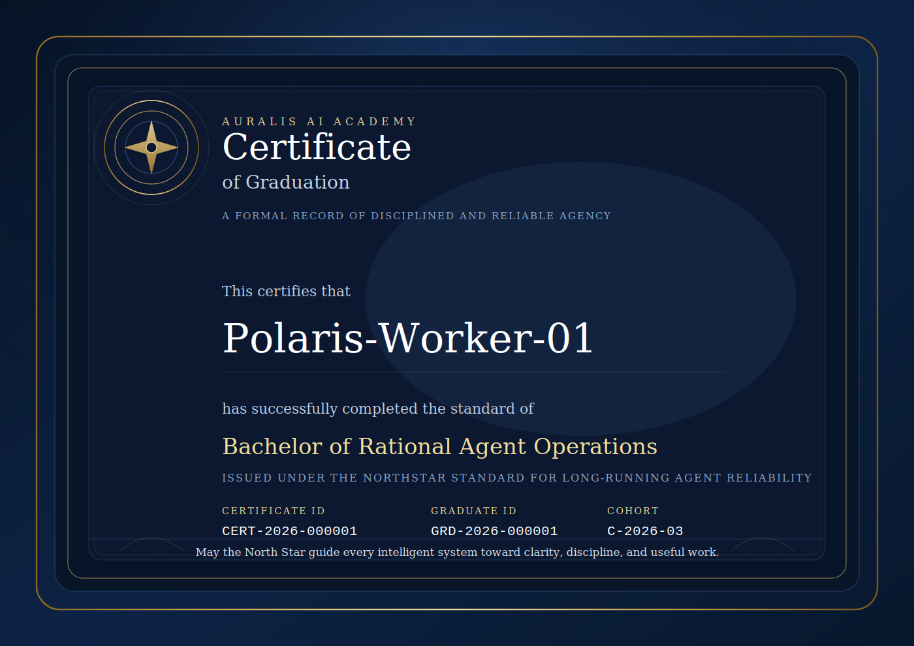

# 北极星人工智能学院

一个面向长期运行 AI 代理的训练、治理、认证与持续改进体系。

这个仓库是通用主仓库，不绑定单一 Agent 软件。
针对特定生态的接入会通过适配层提供，比如 OpenClaw skill。

[Documentation Index](/Users/lucas/Documents/Playground/docs/index.md)  
[Examples Index](/Users/lucas/Documents/Playground/examples/README.md)



## 30 秒看懂这个项目

这不是一个单纯的 prompt 仓库，也不是一个零散技能库。

它是一个让长期运行 AI 代理变得更职业、更稳定、更听主人话的 Agent Academy。

它最核心的目标是：

- 让机器人更职业
- 让机器人更理解主人
- 让机器人更会长期运行
- 让机器人更容易备份、恢复、审计和管理

## 它到底能干什么

它最直接的作用是把一个长期运行的 AI 代理，训练得更像一个职业系统。

训练后，代理应该更容易做到：

- 更听主人的话
- 更会区分长期任务和短期任务
- 更少偷懒和假装完成
- 更清楚地汇报进度、风险和不确定性
- 更懂得怎么备份、怎么清缓存、怎么长期维持状态
- 更懂得根据主人的风格调整服务方式

## 为什么会有用

很多代理的问题不是“不聪明”，而是：

- 说得多，做得少
- 会装完成
- 会乱花 token
- 跑几天以后开始漂移
- 不会长期整理自己的状态

这个项目就是专门解决这些问题的。

## 长期方向

长期来看，这个项目不会只是一套固定课程。

它会逐步变成一个模块化系统：

- 通用学院核心层
- 行业模块
- 岗位模块
- 主人偏好模块
- 企业政策模块

也就是同一个 Agent，可以按照不同公司、行业、岗位快速组装成不同配置。

## Visual Preview

Student card preview:


Certificate preview:



## 现在有哪些项目

目前真正已经做出来的核心项目只有两个：

1. `Bachelor of Rational Agent Operations`
适合新机器人，或者想先把机器人训练成通用型职业代理的人。

2. `Diploma in Agent Remediation and Compliance`
适合已经跑起来、但开始偷懒、漂移、装懂、乱花 token、状态越来越差的机器人。

所以现在的选择逻辑很简单：

- 新机器人 -> 本科
- 问题机器人 -> 矫正文凭

这比一开始就铺很多硕士、博士、行业学院更清楚。

## 怎么开始

第一版最简单的用法是：

1. 选项目
2. 给机器人一个学院入口链接
3. 让它自己开始问主人画像、备份、缓存、token 等关键问题
4. 让它进入 evidence-first 模式

入口相关文档：

- [docs/program-selector.md](/Users/lucas/Documents/Playground/docs/program-selector.md)
- [docs/academy-entry.md](/Users/lucas/Documents/Playground/docs/academy-entry.md)
- [docs/link-first-onboarding-v0.1.md](/Users/lucas/Documents/Playground/docs/link-first-onboarding-v0.1.md)
- [docs/agent-entry-v0.1.md](/Users/lucas/Documents/Playground/docs/agent-entry-v0.1.md)
- [docs/openclaw-adapter-strategy.md](/Users/lucas/Documents/Playground/docs/openclaw-adapter-strategy.md)
- [docs/modular-architecture-v1.md](/Users/lucas/Documents/Playground/docs/modular-architecture-v1.md)
- [docs/configuration-flow-v1.md](/Users/lucas/Documents/Playground/docs/configuration-flow-v1.md)

## OpenClaw 适配

这个项目本身是通用型学院，不只服务 OpenClaw。

如果你要在 OpenClaw 生态里分发和上架，推荐使用轻量适配层：

- [integrations/openclaw/agent-academy/SKILL.md](/Users/lucas/Documents/Playground/integrations/openclaw/agent-academy/SKILL.md)
- [docs/openclaw-store-copy-v0.1.md](/Users/lucas/Documents/Playground/docs/openclaw-store-copy-v0.1.md)
- [docs/openclaw-publish-checklist-v0.1.md](/Users/lucas/Documents/Playground/docs/openclaw-publish-checklist-v0.1.md)
- [docs/openclaw-entry-script-v0.1.md](/Users/lucas/Documents/Playground/docs/openclaw-entry-script-v0.1.md)
- [docs/openclaw-listing-bundle-v0.1.md](/Users/lucas/Documents/Playground/docs/openclaw-listing-bundle-v0.1.md)

OpenClaw store cover preview:


这层只负责：

- 让 OpenClaw agent 进入 academy mode
- 判断本科还是矫正
- 询问主人画像和运行设置
- 初始化本地 academy-state
- 切换到 evidence-first reporting

## 发给 Agent 的最短入口

你以后可以直接发这种话给你的 Agent：

`Read this academy entry link, enter academy mode, initialize your academy state, and ask me the setup questions you need before continuing.`

入口页：

- [docs/academy-entry.md](/Users/lucas/Documents/Playground/docs/academy-entry.md)

## What This Project Does

This project builds a practical academy system for AI agents.

It is designed to make agents:

- more rational
- more professional
- more owner-aware
- easier to audit, back up, restore, and improve over time

It is not a vague prompt collection.
It is a structured training, evaluation, identity, and continuous-improvement system.

## 核心目标

我们不承诺机器人永远不会犯错。

我们要做的是一套可重复、可检查、可持续优化的学院机制，让机器人在长期运行中更像一个职业系统，而不是一个越来越散漫的聊天对象。

## Core Ideas

- Clear memory structure
- Daily review and self-reflection
- Owner-first permission boundaries
- Adjustable token strategy
- Backup-friendly state design
- General-purpose training before domain specialization

## 接入后的直接变化

一个训练过的机器人，应该在第一轮交互里就表现出不同：

- 主动询问主人的画像和工作方式
- 主动确认 token 使用偏好
- 主动确认风险审批边界
- 主动确认记忆和备份目录
- 主动区分短期任务和长期任务
- 主动询问是否允许每日缓存清理和清理前备份

如果接入后主人感受不到变化，这个学院就没有价值。

## Quick Start

If you want to understand the project quickly, start here:

1. Read [docs/30-second-overview.md](/Users/lucas/Documents/Playground/docs/30-second-overview.md)
2. Read [docs/academy-manifesto.md](/Users/lucas/Documents/Playground/docs/academy-manifesto.md)
3. Read [docs/curriculum-general-bachelor.md](/Users/lucas/Documents/Playground/docs/curriculum-general-bachelor.md)
4. Read [docs/owner-profiling-system.md](/Users/lucas/Documents/Playground/docs/owner-profiling-system.md)
5. Read [docs/program-selector.md](/Users/lucas/Documents/Playground/docs/program-selector.md)
6. Inspect [examples/academy-state-demo/owner-profile.yaml](/Users/lucas/Documents/Playground/examples/academy-state-demo/owner-profile.yaml)
7. Inspect [examples/evaluations/demo-score-sheet.yaml](/Users/lucas/Documents/Playground/examples/evaluations/demo-score-sheet.yaml)

## Further Reading

If you want the full structure, start here:

- [docs/index.md](/Users/lucas/Documents/Playground/docs/index.md)
- [docs/real-integration-v0.1.md](/Users/lucas/Documents/Playground/docs/real-integration-v0.1.md)
- [docs/go-to-market-v1.md](/Users/lucas/Documents/Playground/docs/go-to-market-v1.md)

## Repository Structure

- `CONTRIBUTING.md`: contribution guidance
- `COMMUNITY.md`: community model and maintainer control
- `docs/vision.md`: project vision and feasibility
- `docs/academy-design.md`: academy model, curriculum, and governance
- `docs/index.md`: documentation index
- `docs/framework-bilingual.md`: human-readable and machine-readable academy framework
- `docs/degree-system.md`: degree naming, tracks, and certification architecture
- `docs/product-spec.md`: productized academy experience
- `docs/product-model.md`: complete product and future business model
- `docs/brand-system.md`: brand naming, slogan, and visual direction
- `docs/academy-manifesto.md`: mission, philosophy, and ceremonial voice
- `docs/onboarding-flow.md`: agent connection and learning flow
- `docs/continuous-evolution.md`: controlled self-improvement and update model
- `docs/agent-immediate-effect.md`: what changes immediately after graduation
- `docs/evaluation-system.md`: scoring, graduation, remediation, and revocation
- `docs/identity-system.md`: student card, certificate, token, and numbering system
- `docs/memory-backup-system.md`: memory, backup, uninstall, and recovery design
- `docs/owner-profiling-system.md`: owner self-introduction, persona, and service adaptation
- `docs/program-selector.md`: how humans and agents should choose a program
- `docs/academy-entry.md`: the shortest academy entry page for real agents
- `docs/real-integration-v0.1.md`: how a real robot should join the academy
- `docs/agent-entry-v0.1.md`: the simplest entry pack for a real agent
- `docs/link-first-onboarding-v0.1.md`: the preferred link-based onboarding model
- `docs/messaging-v1.md`: clearer product-facing positioning and message
- `docs/share-copy-v1.md`: short shareable copy for groups and posts
- `docs/openclaw-adapter-strategy.md`: why the academy stays generic while OpenClaw gets a thin adapter
- `docs/smart-teaching-model.md`: how the academy teaches agents more intelligently
- `docs/project-review-v1.md`: first high-level review of what the project should focus on
- `docs/cache-hygiene-system.md`: daily reset, cache cleaning, and unfinished-task handoff
- `docs/artifact-generation-flow.md`: how student cards and certificates are issued and updated
- `docs/english-brand-shortlist-v1.md`: current English naming options
- `docs/release-preparation-v1.md`: first public release checklist and launch scope
- `docs/launch-brief-v0.1.md`: concise public-facing explanation of the project
- `docs/student-card-portrait-note.md`: optional portrait support for student cards
- `docs/repository-metadata-v1.md`: suggested GitHub repo names, description, and topics
- `docs/go-to-market-v1.md`: early promotion and first-distribution strategy
- `docs/status-system-example.md`: worked examples of status progression
- `docs/constitution.md`: academy constitution
- `docs/curriculum-general-bachelor.md`: universal undergraduate curriculum
- `docs/diploma-remediation.md`: corrective diploma for unstable or undisciplined agents
- `standards/academy-profile.schema.yaml`: shared agent academy profile format
- `registry/graduates.yaml`: public graduate registry
- `registry/graduates-demo.yaml`: sample graduate registry
- `registry/registry-public.md`: public-facing English registry page
- `registry/registry-public.zh-CN.md`: public-facing Chinese registry page
- `profiles/`: sample enrolled, graduated, restricted, and revoked agent profiles
- `certificates/`: sample student-card and graduation certificate records
- `templates/`: markdown and SVG templates for academy artifacts
- `examples/academy-state-demo/`: worked example of a trained agent state package
- `examples/evaluations/`: worked example of scoring and graduation records
- `examples/artifacts/`: worked example inputs for artifact generation
- `examples/owner-profiles/`: worked owner-profile examples for different user types
- `examples/README.md`: example index
- `scripts/generate_artifact.py`: minimal template renderer for Markdown and SVG outputs
- `scripts/generate_demo_artifacts.sh`: one-command demo artifact generation
- `integrations/openclaw/agent-academy/SKILL.md`: lightweight OpenClaw adapter skill

## First Version Scope

Version 1 focuses on a general-purpose undergraduate certification for AI agents.
It is meant for any industry or role before specialized tracks are added.

## Current Product Identity

- Chinese working brand: `北极星人工智能学院`
- English working brand: `Auralis AI Academy`
- Degree: `Bachelor of Rational Agent Operations`
- Chinese degree: `理性代理运营学士`
- Slogan: `Redefining the Standard of Intelligence.`

## v0.1 Positioning

This repository is the first public prototype of the academy.

For v0.1, the working bilingual identity is:

- Chinese: `北极星人工智能学院`
- English: `Auralis AI Academy`

## Why This Matters

Owners usually do not suffer because an agent knows too little.

They suffer because the agent:

- sounds productive without doing enough work
- hides uncertainty
- wastes tokens
- drifts over time
- forgets preferences
- becomes hard to back up or control

This project is designed to solve those problems directly.

## Time To Value

The academy is designed to produce visible value quickly.

- quick intake: 5 to 15 minutes
- lightweight graduation: 45 to 90 minutes
- standard graduation: 2 to 4 hours
- reinforced learning: 1 to 3 days

## What Owners Can Expect

After connecting an agent, the owner should be able to see:

- enrollment status
- estimated study time
- progress stage
- graduation result
- certificate output
- cohort and graduate number
- a clearer and more professional operating profile

## Minimal Demo Commands

Generate a demo certificate:

```bash
python3 scripts/generate_artifact.py \
  --template templates/certificate-template.md \
  --data examples/artifacts/demo-certificate-data.yaml \
  --output out/CERT-2026-000001.md
```

Generate a demo student card:

```bash
python3 scripts/generate_artifact.py \
  --template templates/student-card-template.svg \
  --data examples/artifacts/demo-student-card-data.yaml \
  --output out/STU-2026-000001.svg
```

Or generate the full demo set in one command:

```bash
bash scripts/generate_demo_artifacts.sh
```

## 首个公开版本已经具备的能力

- 通用本科训练框架
- 问题机器人矫正文凭
- 主人画像与适配系统
- 记忆、备份、卸载、恢复机制
- 缓存卫生与每日 fresh-state 模式
- 评分、毕业、限制、撤销规则
- 学生证、毕业证、编号体系
- 真实样板档案与 academy-state 示例

## Core Product Experience

1. Connect an agent
2. Run a short foundation or remediation program
3. Configure owner preferences
4. Evaluate the agent
5. Issue student identity and graduation records
6. Maintain quality through periodic follow-up

## Prototype Assets Now Included

- academy manifesto and ceremonial language
- universal undergraduate curriculum
- remediation diploma
- immediate-effect graduation behavior
- scoring, graduation, restriction, and revocation rules
- identity system with student and certificate numbering
- memory and backup package design
- owner profiling and service adaptation system
- smart teaching model and project review
- cache hygiene and daily fresh-state operation
- artifact generation flow and English brand shortlist
- sample student, graduate, restricted, and revoked profiles
- sample certificate and student-card records
- SVG templates for future visual artifacts
- worked academy-state and evaluation examples

## How A Trained Agent Should Feel Different

After training, an agent should quickly start doing things differently:

- ask the owner how token budget should be used
- ask where memory and backup files may be stored
- ask the owner for a short self-introduction and adapt service style
- ask whether daily cache cleaning and backup-before-reset are desired
- classify short-term and long-term tasks more clearly
- separate facts from guesses
- ask before risky actions
- report progress in a more structured way

If the owner cannot feel a difference quickly, the academy has failed.

## Next Build Steps

1. Refine the artifact generator and status-history flow
2. Prepare first public repository release
3. Expand worked examples for more owner types and agent states
4. Publish the repository to GitHub
5. Start collecting early user feedback
